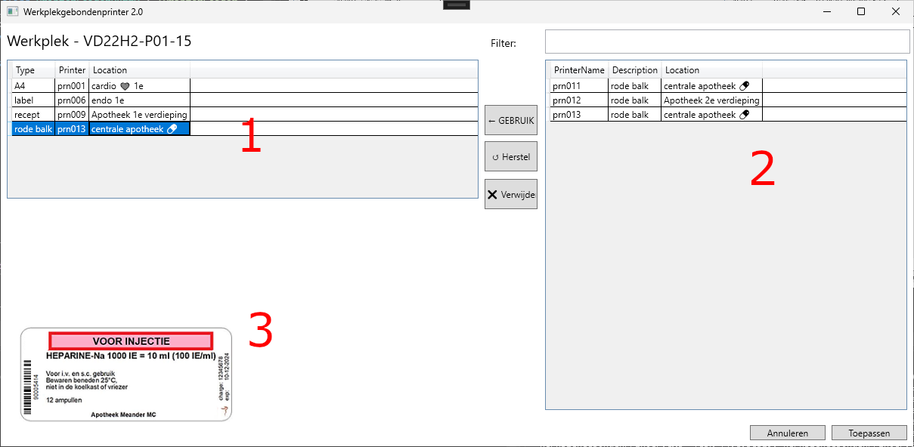

# Project doelen

Het doel is om gebruikers per werkplek hun eigen printer te laten kiezen, deze
geldt hierna voor iedereen die hier op deze werkplek inlogt. Hix kan door de
omschrijving uit te lezen bepalen welke type printers gekoppeld zijn en
hierdoor direct de juiste printer gebruiken voor een bepaald etiket.

# Uitgangspunten

* Zo simpel mogelijk.
* Generiek.
* Makkelijk te onderhouden.
* [Semantic Versioning](https://semver.org/)

# Implementatie

Het is gebouwd in c# met xaml als grafische schil. Allemaal .net 4.8 omdat hix
toch ook 4.8 is. Het handigste is om Microsoft SQL server te gebruiken als
backen, maar files zijn zijn ook mogelijk om makkelijk te kunnen testen.

De beschikbare printers worden direct uit active directory gehaald, dit maakt
het makkelijk om te publiceren of in te trekken. Op de printserver -> "list in
active directory" en klaar.

## Hoe ziet het eruit?

 1. Huidige printers
 1. Mogelijke printers
 1. Voorbeeld van het type printer

# Verbeterpunten

* Filteren op hostname zodat thuiswerkers hun machine namen er niet inkomen (bijv. wr_b81oiunmoul).
* Config file met instellingen.
* Details over printer bij selecteren (printserver/sticker type etc).
* Server naam meenemen zodat dezelfde printernamen gebruikt kunnen worden.

# Tips

## Opstarten

Standaard kan je get direct starten met `WerkplekGebondenPrinter.exe`
Je kan kiezen om andere loaders te gebruiken zoals active directory of sql :
`
WerkplekGebondenPrinter-0.1.0.exe -d  -l h:\wpg-client.txt --cwd u:\Werkplekgebondenprinter2 --PrinterLoader PrinterLoaderAD
`

En als je de printers wil verversen (bij inloggen of wisselen van werkplek).
`
WerkplekGebondenPrinter.exe --sync -l h:\wpg-sync.txt --cwd u:\Werkplekgebondenprinter2
`
